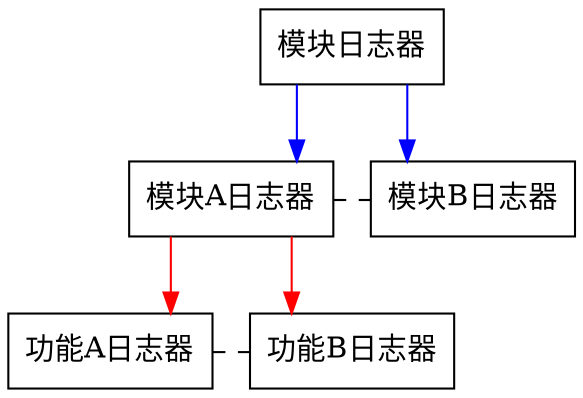
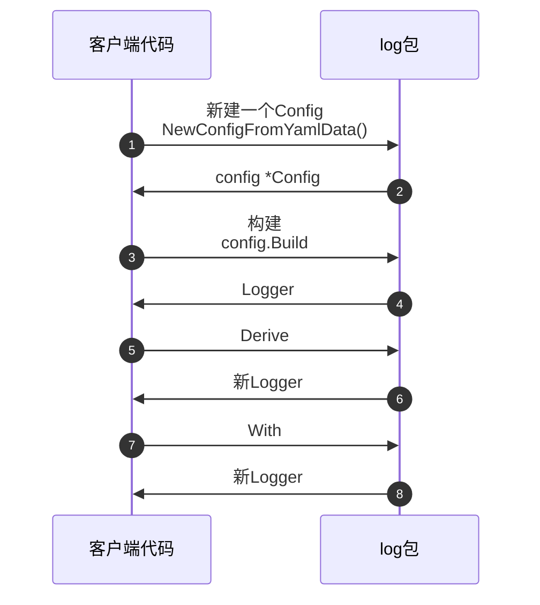

[TOC]

# 概述

# 版本

| 版本   | 修改时间                | 修改人     | 修改内容                                              |
|------|---------------------|---------|---------------------------------------------------|
|      |                     |         |                                                   |
| v0.5 | 2022-12-14 16:24:47 | everest | 允许在配置[LevelToPath](#config)中直接配置不同level输出到不同文件    |
| v0.4 | 2022-12-02 08:36:51 | everest | 处理了多次Derive()导致重复的问题                              |
| v0.3 | 2022-11-17 14:09:01 | everest | 添加从toml 文件构建                                      |
| v0.2 | 2021-04-06 10:34:42 | everest | 添加一个配置项，[JSON](#config),允许将整个日志作为JSON输出，配合grayLog |
| v0.1 | 2021-04-02 20:39    | everest | 初步完成                                              |

# 详述


[ci-result](ci-result)

## 目标

- [x] 不同的日志级别
    - [ ] 不同的模块可以使用不同的日志级别
    - [ ] 级别接受内嵌式定义，层级不受影响
    - [x] 运行时调整日志级别
- [x] 支持输出到stdout和文件，并且文件提供rotate
- [x] 使用结构化的输出，而不是fmt格式
- [x] 携带代码行数，方便定位
    - [x] 开发环境展示完整路径,可点击
    - [x] 线上环境展示相对路径

## 概念

### 日志器的层级和领域



* 蓝色的线表示**衍生Derive 每个实例有单独的级别，互不影响**
* 红色的线表示**添加信息With 可以添加各自不同信息**

### 结构化输出和fmt输出

结构化输出是指输出信息以多个字段出现，每个字段**key:value**,比如

```json
jsonPayload: {"pri": "6", "host": "192.168.0.1", "ident": "fluentd", "pid": "11111", "message": "[error] Syslog test"}
```

fmt输出是

```
<4>Nov 21 2:53:17 192.168.0.1 fluentd[11111]: [error] Syslog test
```

通过fmt输出时，我们会使用`描述[值]`的方式，使用结构化输出，强制信息添加描述，更加明确，而且可以被第三方工具所使用

### 日志级别和结构化字段

都由zapcore包(**go.uber.org/zap/zapcore**)或者zap包(**go.uber.org/zap**)提供

#### 日志级别

**zapcore.Level**

```go
const (
// DebugLevel logs are typically voluminous, and are usually disabled in
// production.
DebugLevel Level = iota - 1
// InfoLevel is the default logging priority.
InfoLevel
// WarnLevel logs are more important than Info, but don't need individual
// human review.
WarnLevel
// ErrorLevel logs are high-priority. If an application is running smoothly,
// it shouldn't generate any error-level logs.
ErrorLevel
// DPanicLevel logs are particularly important errors. In development the
// logger panics after writing the message.
DPanicLevel
// PanicLevel logs a message, then panics.
PanicLevel
// FatalLevel logs a message, then calls os.Exit(1).
FatalLevel

_minLevel = DebugLevel
_maxLevel = FatalLevel
)
```

#### 结构化字段

**zap.Field**，常见的类型可以直接操作

```go

func Skip() Field
func nilField(key string) Field { return Reflect(key, nil) }
func Binary(key string, val []byte) Field
func Bool(key string, val bool) Field
func Boolp(key string, val *bool) Field
func ByteString(key string, val []byte) Field
func Complex128(key string, val complex128) Field
func Complex128p(key string, val *complex128) Field
func Complex64(key string, val complex64) Field
func Complex64p(key string, val *complex64) Field
func Float64(key string, val float64) Field
func Float64p(key string, val *float64) Field
func Float32(key string, val float32) Field
func Float32p(key string, val *float32) Field
func Int(key string, val int) Field
func Intp(key string, val *int) Field
func Int64(key string, val int64) Field
func Int64p(key string, val *int64) Field
func Int32(key string, val int32) Field
func Int32p(key string, val *int32) Field
func Int16(key string, val int16) Field
func Int16p(key string, val *int16) Field
func Int8(key string, val int8) Field
func Int8p(key string, val *int8) Field
func String(key string, val string) Field
func Stringp(key string, val *string) Field
func Uint(key string, val uint) Field
func Uintp(key string, val *uint) Field
func Uint64(key string, val uint64) Field
func Uint64p(key string, val *uint64) Field
func Uint32(key string, val uint32) Field
func Uint32p(key string, val *uint32) Field
func Uint16(key string, val uint16) Field
func Uint16p(key string, val *uint16) Field
func Uint8(key string, val uint8) Field
func Uint8p(key string, val *uint8) Field
func Uintptr(key string, val uintptr) Field
func Uintptrp(key string, val *uintptr) Field
func Reflect(key string, val interface{}) Field
func Namespace(key string) Field
func Stringer(key string, val fmt.Stringer) Field
func Time(key string, val time.Time) Field
func Timep(key string, val *time.Time) Field
func Stack(key string) Field
func StackSkip(key string, skip int) Field
func Duration(key string, val time.Duration) Field
func Durationp(key string, val *time.Duration) Field
func Object(key string, val zapcore.ObjectMarshaler) Field
func Any(key string, value interface{}) Field 
```

## 使用



### <span id="config">配置 </span>

#### yaml

```yaml
service: test   # 服务名称
level: debug    # 日志级别，分别为debug,info,warn,error,fatal,panic
filePath: "a"   # 日志路径, 本地文件路径,如果为空，表示不输出到文件
timeZone: "b"   # 时区，默认defaultTimeZone,可以从https://www.zeitverschiebung.net/en/ 查询时区信息
timeLayout: "c" # 输出时间格式,默认为defaultTimeLayout,任何Go支持的格式都是合法的
debug: true     # 是否调试，调试模式会输出完整的代码行信息,其他模式只会输出项目内部的代码行信息
json: true      # 是否作为完整JSON输出,0.2版本添加
rotate:
  maxSize: 200  # 最大大小，0.3版本添加
levelToPath:
  info: "info.log"
```

#### toml

对应的方法`NewConfigFromToml`

```toml
service = "test"   # 服务名称
level = "debug"    # 日志级别，分别为debug,info,warn,error,fatal,panic
filePath = "a"   # 日志路径, 本地文件路径,如果为空，表示不输出到文件
timeZone = "b"   # 时区，默认defaultTimeZone,可以从https = //www.zeitverschiebung.net/en/ 查询时区信息
timeLayout = "c" # 输出时间格式,默认为defaultTimeLayout,任何Go支持的格式都是合法的
debug = true     # 是否调试，调试模式会输出完整的代码行信息,其他模式只会输出项目内部的
json = true
rotate.maxSize = 200 # rotate大小
[levelToPath]
debug = "debug.log"
info = "info.log"
```

##### 使用viper

对于viper 用户，需要这样处理

1. `Get(x)` x 是整个配置的章节名称
2. 使用`toml.Marshal`序列化
3. 使用`NewConfigFromToml`

参考`config_test.go`中的`TestViper`

### 示例

```go
func TestConfig_Build(t *testing.T) {
var (
cfg = &Config{
Service: "test",
Level:   zapcore.DebugLevel,
Debug:   true,
// FilePath: `a`,
}
)

originLogger, err := cfg.Build()
require.NoError(t, err, `构建错误`)

// With 添加字段
originLogger = originLogger.With(zap.String(`a`, `x`), zap.String(`b`, "y"))
// Debug输出可见
originLogger.Debug(`a`)

// 验证日志器
infoLogger := originLogger.Derive(`提现`)
// Debug 可见
infoLogger.Debug(`debug1`)
// 设置为Info
infoLogger = infoLogger.SetLevel(zapcore.InfoLevel)
// Debug 不可见
infoLogger.Debug(`debug2`)
// Debug 可见
originLogger.Debug(`origin Debug`)
// Info 可见
infoLogger.Info(`infoLogger.Info`)
// Warn 可见
infoLogger.Warn(`infoLogger.Warn`)

infoLogger = infoLogger.With(zap.String(`info`, `info`))

infoLogger.Info(`infoLogger.Info`)
// 再次衍生
debugLogger := infoLogger.Derive(`汇总`)
// Debug不可见
debugLogger.Debug(`debug1`)
// 设置为Debug
debugLogger = debugLogger.SetLevel(zapcore.DebugLevel)
// Debug可见
debugLogger.Debug(`debug2`)

taskLogger :=debugLogger.Start()
taskLogger.Info(`开始`)
}
```

```bash
2021-04-03 19:16:54.839	DEBUG	/Users/xxx/projects/fj/go-log/log/config_test.go:55	a	{"系统": "test", "a": "x", "b": "y"}
2021-04-03 19:16:54.839	DEBUG	提现	/Users/xxx/projects/fj/go-log/log/config_test.go:60	debug1	{"系统": "test", "a": "x", "b": "y"}
2021-04-03 19:16:54.839	DEBUG	/Users/xxx/projects/fj/go-log/log/config_test.go:66	origin Debug	{"系统": "test", "a": "x", "b": "y"}
2021-04-03 19:16:54.839	INFO	提现	/Users/xxx/projects/fj/go-log/log/config_test.go:68	infoLogger.Info	{"a": "x", "b": "y"}
2021-04-03 19:16:54.839	WARN	提现	/Users/xxx/projects/fj/go-log/log/config_test.go:70	infoLogger.Warn	{"a": "x", "b": "y"}
2021-04-03 19:16:54.839	INFO	提现	/Users/xxx/projects/fj/go-log/log/config_test.go:74	infoLogger.Info	{"a": "x", "b": "y", "a": "x", "b": "y", "info": "info"}
2021-04-03 19:16:54.839	DEBUG	提现.汇总	/Users/xxx/projects/fj/go-log/log/config_test.go:82	debug2	{"a": "x", "b": "y", "info": "info"}
2021-04-03 19:16:54.839	INFO	提现.汇总	/Users/xxx/projects/fj/go-log/log/config_test.go:85	开始	{"a": "x", "b": "y", "info": "info", "a": "x", "b": "y", "info": "info", "任务ID": "60684ea6f8462e7b9b50aa76"}
```